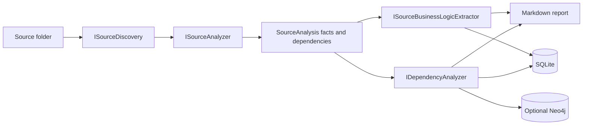
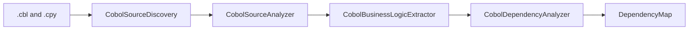
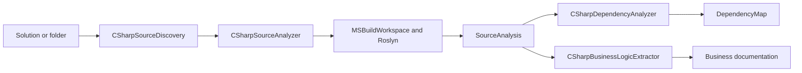

**Last updated**: 2026-08-29

# Current Source Analysis Architecture

This document describes the implementation as it exists today. It separates the
current behavior from the planned module/context discovery work.

## Entry points

`Program.cs` exposes the `reverse-engineer` command:

```bash
# COBOL analysis and LLM-backed business documentation
dotnet run -- reverse-engineer --source /path/to/cobol --source-language Cobol --output output

# C# deterministic analysis, without an AI provider
dotnet run -- reverse-engineer --source /path/to/dotnet --source-language CSharp --output output

# C# deterministic analysis followed by grounded LLM documentation
dotnet run -- reverse-engineer --source /path/to/dotnet --source-language CSharp \
  --extract-business-logic --output output
```

The last command requires a configured AI provider. C# technical facts are
always collected before the optional LLM business-documentation stage.

## Pipeline



`Processes/ReverseEngineeringProcess.cs` owns this four-step, language-neutral
orchestration:

1. Discover source files.
2. Perform technical analysis.
3. Extract business documentation.
4. Map dependencies and generate reports.

It depends only on the contracts in `SourceAnalysis/Interfaces/`:

| Contract | Responsibility |
|---|---|
| `ISourceDiscovery` | Locates and reads language-specific source files. |
| `ISourceAnalyzer` | Produces deterministic or language-specific technical facts. |
| `ISourceBusinessLogicExtractor` | Produces human-readable business documentation. |
| `IDependencyAnalyzer` | Maps source facts to the existing dependency graph. |
| `ISourceAnalysisReportFormatter` | Formats language-specific technical details. |
| `ISourceFilePersistence` | Optionally persists discovered source artifacts. |

The shared models are `SourceFile`, `SourceAnalysis`, `SourceFact`,
`SourceDependency`, and `SourceLanguage`.

## COBOL implementation

COBOL retains its existing specialized behavior through adapters in
`SourceAnalysis/Cobol/`.



`CobolFile` and `CobolAnalysis` remain compatibility models over the neutral
models. Large COBOL inputs may instead be routed through
`ChunkedReverseEngineeringProcess`, which preserves the existing semantic
chunking workflow.

## C# implementation

The C# implementation is in `SourceAnalysis/CSharp/`.



`CSharpSourceDiscovery` finds `.cs` files recursively and excludes `bin`,
`obj`, and `.git`. `CSharpSourceAnalyzer` groups discovered files by their
owning solution, falling back to the nearest project, so a folder containing
multiple solutions or projects is supported.

Roslyn establishes the following facts without an LLM:

- solutions, projects, project references, and NuGet package references;
- namespaces, types, base types, interfaces, methods, constructors, fields,
  properties, and invocations;
- ASP.NET controllers and attribute-routed endpoints;
- generic DI registrations;
- EF Core contexts, entity sets, and database calls; and
- directly detectable event producers and consumers.

When `--extract-business-logic` is supplied, `CSharpBusinessLogicExtractor`
sends each eligible C# source artifact together with its Roslyn facts and
relationships to the configured LLM. It excludes tests and generated artifacts
from this documentation pass, but it does **not** yet classify application
composition, infrastructure, or domain behavior.

## Persistence and reports

Every run creates a SQLite run record in the configured `migration.db`.
Business documentation is persisted in `business_logic`; its identity is
`run_id` plus `file_path`, allowing same-named files from distinct projects.
Dependency maps are stored in SQLite for every run.

Neo4j is optional. When configured, `HybridMigrationRepository` writes the
dependency graph to Neo4j in addition to SQLite. The shared graph node label is
`SourceArtifact`; COBOL writes also retain `CobolFile` for compatibility with
existing graph data and queries.

Each reverse-engineering run writes:

| Artifact | Contents |
|---|---|
| `reverse-engineering-details.md` | Business documentation followed by technical analysis. |
| `dependency-map.json` | Machine-readable dependency map. |
| `dependency-diagram.md` | Mermaid rendering of the dependency graph. |

## Current limitations

The reporting unit is still a **source artifact**, not an application module or
logical context. The existing C# exclusion rules avoid tests and generated
files, but `Program.cs`, DI wiring, middleware, repositories, and similar
technical artifacts can still be documented as if they were business behavior.

The next architectural increment should introduce deterministic artifact-role
classification and module/context discovery between Roslyn analysis and
business-document extraction. That increment should change the primary report
from per-file findings to an application landscape plus module-level dossiers.
