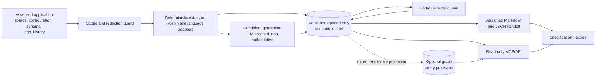
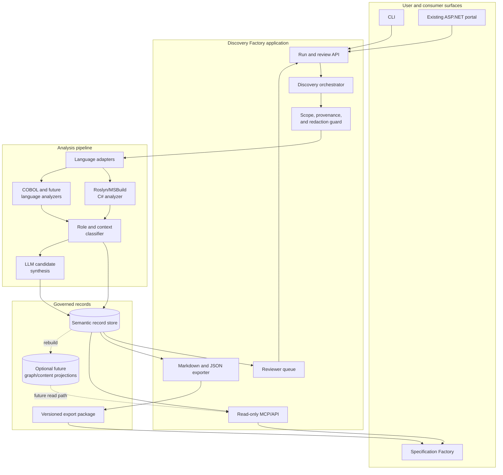
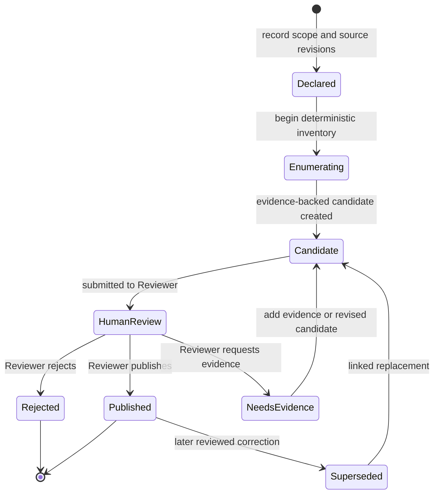
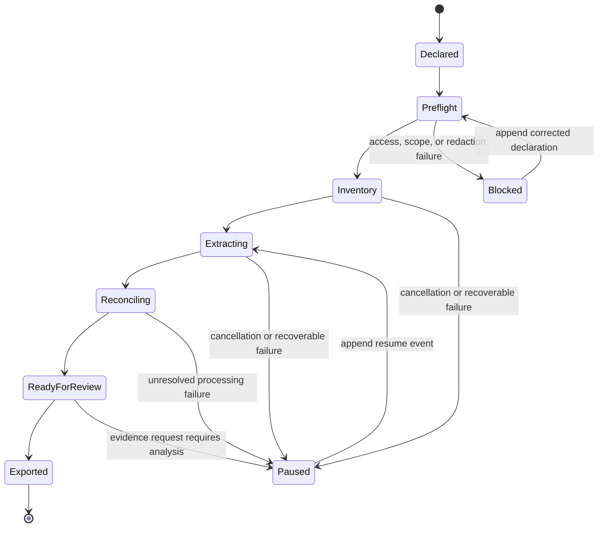
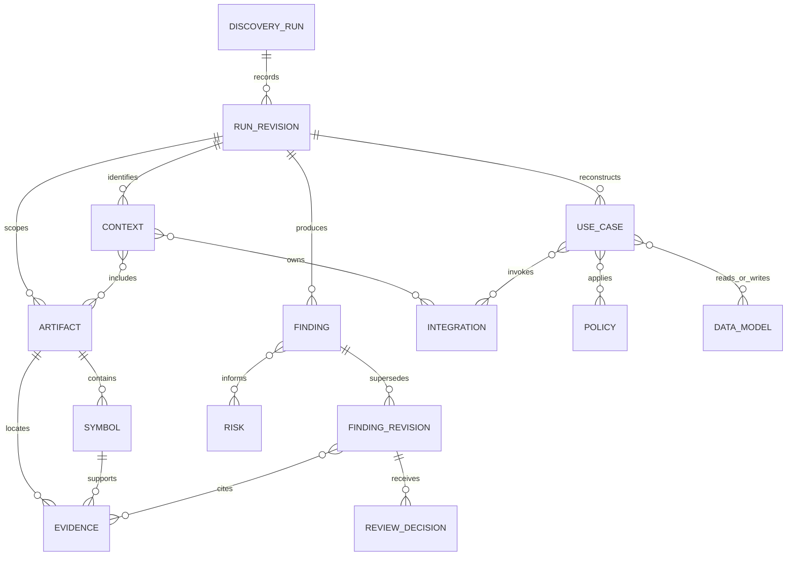
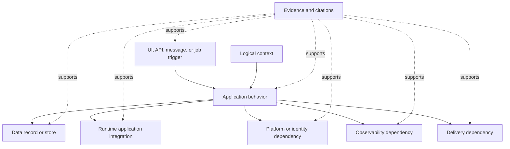
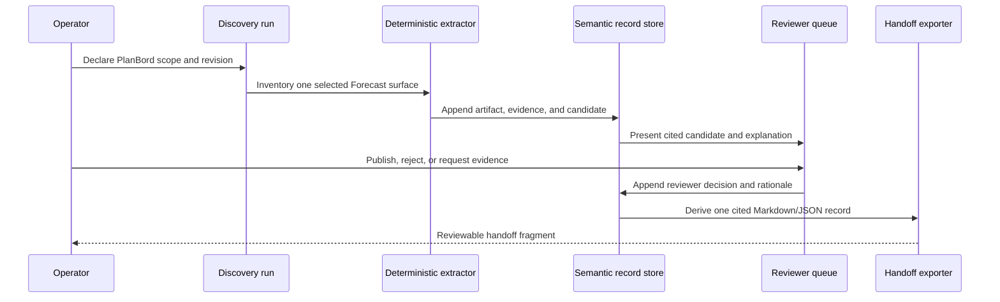

**Last updated**: 2026-08-30

# Discovery Factory technical design

> **Status:** Draft for architecture review
> **Related plan:** [Epic #1](https://github.com/arnoldboersma/Legacy-Modernization-Agents/issues/1)

## 1. Purpose

Discovery Factory reconstructs the current state of an application as a semantic model.
Specification Factory consumes a readable handoff and can ask bounded, evidence-backed
questions through a future read-only MCP/API query layer.

The goal is to let a modernization team work from the reconstruction without routine
source-code browsing. It is not a claim that every implementation detail or unobserved
runtime behavior can be recreated. Every answer must identify its evidence, confidence,
declared scope, and known gaps.

Discovery Factory does not produce a target architecture, modernization roadmap,
implementation backlog, or future-state recommendation for the assessed application.

## 2. Design principles

| Principle | Design consequence |
|---|---|
| Current state is evidence-backed | Every consumer-facing claim links to findings and citations. |
| History is append-only | Runs, candidates, evidence links, reviewer decisions, and corrections are added as records; they are not overwritten or deleted. |
| Humans publish findings | LLM output can prioritize and explain candidates but cannot publish a fact. |
| Scope is explicit | Completeness is assessed only within declared source, evidence, and exclusion boundaries. |
| Sensitive values are not discovery data | Secrets, PII, payloads, and resolved configuration values are redacted before LLM use or persistence. |
| Semantic model before prose | Markdown and JSON are derived views of typed records, not the source of truth. |
| Queries retain evidence | MCP/API responses return evidence, confidence, provenance, and gaps with the requested facts. |
| Graphs are derived | A future graph is a read-only query projection, never the place where reviews or authoritative history are edited. |

## 3. System context

### 3.1 Authoritative boundaries

The selected governed record store holds the versioned semantic model and append-only
review history. The architecture decision for the record-store provider and any
relational-versus-graph authority is intentionally deferred.

Neo4j is not required for the initial pilot. If adopted later, it projects artifacts,
symbols, contexts, dependencies, use cases, policies, data, integrations, findings, and
evidence relationships for topology and impact queries. It is rebuilt from governed
records and exposed only through read-only query operations.

Full source-code/comment ingestion and vector retrieval are also deferred. The initial
model retains semantic facts, source locators/hashes, and permitted redacted excerpts.
The later content-index decision must assess redaction, access control, retention cost,
and retrieval benefit before retaining a source/comment corpus.

### 3.2 Target application architecture

The application is organized around a deterministic analysis core. The portal and CLI
are delivery surfaces over the same orchestration and governed records; they do not own
separate discovery state.

| Component | Responsibility |
|---|---|
| CLI and portal | Start runs, display run status and outputs, and provide the minimal human review queue. |
| Run and review API | Validates run declarations and appends reviewer decisions; no client writes directly to persistence. |
| Discovery orchestrator | Coordinates declared-scope analysis, record creation, export generation, and optional candidate synthesis. |
| Scope/provenance/redaction guard | Enforces declared boundaries, records provenance, and removes disallowed sensitive content before later processing. |
| Language adapters and analyzers | Extract deterministic source, schema, configuration, and dependency facts into neutral records. |
| Role/context classifier | Proposes evidence-backed artifact roles and logical context boundaries without equating files, controllers, or projects to domains. |
| LLM candidate synthesis | Produces review-priority suggestions and explanations from permitted evidence; it does not publish facts. |
| Semantic record store | Retains semantic records and append-only review history selected by the later persistence architecture decision. |
| Exporter and query layer | Derive the Specification Factory handoff and expose bounded read-only evidence queries. |
| Future projections | Rebuildable graph and content/vector projections for topology, impact, and detailed retrieval; not pilot prerequisites. |

### 3.3 Analysis execution pipeline

Analysis proceeds through language-neutral work items. Each item records a source locator,
content hash, adapter version, declared scope revision, and processing status so that
processing is idempotent and recoverable.

```mermaid
flowchart LR
    Declare[Declare source scope\nand revision]
    Preflight[Preflight\naccess, redaction, inventory]
    Enumerate[Enumerate artifacts\nand classify work]
    Plan[Plan work items\nand semantic chunks]
    Queue[Bounded work queue]
    Extract[Deterministic extraction]
    Validate[Validate and reconcile\nfacts, duplicates, closure]
    Candidate[Optional LLM candidate\nsynthesis]
    Review[Human review]
    Export[Derive exports]

    Declare --> Preflight --> Enumerate --> Plan --> Queue --> Extract --> Validate
    Validate --> Candidate --> Review --> Export
    Validate --> Review
```

Language adapters own parsing, semantic boundary selection, and any chunk overlap needed
to preserve language semantics. The scheduler does not assume files are independent:
it records dependencies between work items and defers cross-artifact reconciliation until
the required deterministic facts are available.

Deterministic extraction is mandatory. LLM candidate synthesis is optional and runs only
against permitted, redacted evidence. An LLM outage or invalid candidate cannot block
the deterministic inventory; it is recorded as a limitation when it affects a requested
analysis capability.

### 3.4 Workload, cost, and incremental analysis

The orchestrator uses a bounded queue with configurable concurrency, cancellation, and
back-pressure. It enforces separate budgets for deterministic processing resources and
LLM requests, including request rate, token/cost allowance, retry policy, and maximum
work-item size. These limits are runtime configuration and measured operational data,
not language-specific constants embedded in the design.

An incremental run compares the declared source revision and artifact content hashes with
prior records. Changed artifacts and affected dependents are re-enumerated; unchanged
facts may be reused only when their extractor version, scope, redaction policy, and
dependency inputs still match. Reuse records its source revision and prior record IDs so
the resulting reconstruction remains explainable.

## 4. Versioned append-only lifecycle

A run is a versioned reconstruction over a declared source and evidence boundary. A
later correction is a new linked record or revision, never an in-place change.

### 4.1 Review decision

The first pilot assumes the acting human is `Reviewer`; it does not add a new
authentication or role-management system. Every decision still records reviewer
identity, timestamp, rationale, the candidate revision, and linked evidence.

The portal review queue presents:

- proposed finding and current status;
- review priority supplied by an LLM, if one was used;
- a structured explanation of why the candidate needs attention;
- cited deterministic evidence, uncertainty/conflict signals, affected records, and
  redaction indicators; and
- `Publish`, `Reject`, and `Request evidence` actions, each requiring rationale.

The LLM priority is not a truth score. A finding can only be published through an
append-only human decision based on cited evidence.

### 4.2 Processing, recovery, and closure

The review lifecycle is distinct from run processing. A run may be resumed only by
appending a new processing event that identifies the interrupted work and its reason;
successful records are not re-created without a supersession or reuse link.

Failures are classified as scope/access, redaction, parsing/extraction, dependency,
validation, LLM, persistence, or export failures. Each classification carries the
affected work item, retriability, diagnostic locator, and whether it creates a
consumer-visible gap. The run can only claim closure after every enumerated in-scope
surface is investigated, explicitly excluded, unresolved, or partially investigated.

### 4.3 Operational visibility

The portal and CLI consume the same append-only status stream. They expose run phase,
work-item counts, completion/failure/retry state, queue depth, cache/reuse decisions,
redaction summary, review queue size, and export status.

Sanitized telemetry includes elapsed time by phase, deterministic extractor version,
LLM model/prompt version, request/token/cost measurements where available, and error
classification. It must not contain source payloads, resolved configuration values,
secrets, or PII. Health and diagnostics distinguish a blocked run from a completed run
with explicit gaps.

## 5. Semantic model

The following record families form the primary delivery contract.

| Record family | Required content |
|---|---|
| Run and scope | Subject, declared sources and revisions, inclusions/exclusions, evidence boundaries, tool/model provenance, redaction summary, closure state, and revision links. |
| Artifacts and symbols | Projects, assemblies, source artifacts, symbols/members/signatures, routes, attributes, references, calls, dependencies, and source locators/hashes. |
| Roles | Evidence-backed multi-tag role classification, including business, composition/DI, middleware/pipeline, framework adapter, persistence/explicit Entity Framework, integration adapter, shared, generated, test, build/tooling, and unknown. |
| Contexts and architecture | Candidate logical contexts, modules, ownership, layers, shared/infrastructure separation, memberships, dependencies, and boundary confidence. |
| Use cases and flows | Actors, triggers, permissions, normal/alternative/error flows, commands, events, state changes, participating components, and evidence. |
| Policies and states | Inputs, ordered conditions, precedence, formulas, rounding, temporal semantics, invariants, state transitions, errors, retries, and idempotency where evidenced. |
| Data | Logical entities, fields, types, nullability, identifiers, ownership, relationships, constraints, lifecycle, schema evidence, and source-to-target field flows. |
| Interfaces and integrations | APIs, UI entry points, messages, jobs, files, stores, identity providers, notifications, platform dependencies, direction, contract shape, configuration semantics, and blind spots. |
| Findings and risks | Stable identifiers, current-state statements, confidence, citations, provenance, gaps, assumptions, limitations, severity, status, and escalation questions. |
| Review history | Candidate revisions, LLM assessments, reviewer decisions, rationale, timestamps, and supersession links. |

### 5.1 Deterministic context and role discovery

Candidate contexts are seeded from projects, namespaces, endpoints, callers/consumers,
services, dependency injection, Entity Framework `DbContext`/entities/mappings, and
typed dependency edges. Repeated naming, co-location, ownership, coupling, and cohesion
provide evidence; a project or controller is never assumed to equal a bounded context.

Multiple roles may apply to an artifact. Mixed or unknown role signals remain explicit
and are routed to review rather than forced into business-use-case prompts. Generated
build output and `bin`/`obj` are excluded from primary analysis. Tests, generated Entity
Framework migrations, and stale/excluded source remain tagged technical evidence and do
not define business contexts by default.

### 5.2 Evidence rules

- Supported evidence types are Source code, Configuration, Logs, and Schema.
- Source code, Configuration, and Schema support static claims only.
- Runtime activity requires linked Logs evidence.
- Configuration records capture a key name and semantic role, never its resolved value.
- Every factual claim has a stable finding ID, source locator, provenance chain,
  confidence, review state, and closure/gap status.
- LLM interpretation is candidate material only. It cannot create a deterministic fact,
  confirm a context, or publish a finding.

### 5.3 Conceptual record relationships

This is a provider-neutral conceptual model, not a physical schema. Provider migrations
and the authoritative record-store decision remain deferred.

Stable IDs identify records within a run. Cross-run comparison uses separate
correlation keys and explicit revision/reuse links, never identifier reuse. Derived
Markdown, JSON, graph, and content/vector projections retain these IDs and cannot
invent a relationship absent from the governed records.

### 5.4 LLM execution controls

LLM use is constrained to candidate synthesis and reviewer assistance:

- prompts receive only redacted evidence selected by declared record IDs;
- prompt template/version, model identity, parameters, input record IDs, and output
  schema version are recorded as provenance;
- responses must pass a typed schema and citation validation before becoming candidates;
- candidates are deduplicated through deterministic correlation and evidence links;
- the explanation must distinguish cited fact, candidate interpretation, conflict, and
  unknown; and
- failed, unsafe, or uncited responses are rejected as candidates and recorded as
  limitations where they affect requested coverage.

## 6. Specification Factory handoff

The handoff is a versioned Markdown view and matching JSON export derived from the
semantic model. It has the following reader-facing structure.

1. **Run scope and reconstruction status** - declared inputs, evidence limits,
   redactions, confidence, closure, and revisions.
2. **System purpose and domain landscape** - current functional purpose and logical
   contexts, marked as candidate until human-published.
3. **Use cases and functional flows** - actors, triggers, permissions, normal and
   alternative flows, commands, and events.
4. **Business rules, policies, calculations, and state transitions** - conditions,
   formulas, precedence, temporal behavior, invariants, and failure behavior.
5. **Architecture and component responsibility map** - modules/layers, ownership,
   dependencies, shared services, and business-logic trace locations.
6. **Interfaces and integration topology** - entry points, APIs, messages, jobs, files,
   internal/external dependencies, direction, contracts, and evidence limits.
7. **Data model and lifecycle** - entities, fields, ownership, relationships,
   constraints, lifecycle, schema, and field flows.
8. **Security, configuration, operations, and non-functional constraints** -
   authorization semantics, configuration roles, deployment/runtime topology,
   observability, and evidenced reliability/performance constraints.
9. **Risks, gaps, assumptions, and decisions needed** - technical debt, conflicts,
   uncertainties, limitations, and escalation questions without future-state advice.
10. **Evidence, provenance, and navigation** - stable IDs, citations, confidence,
    review/supersession history, and MCP/API query entry points.

The sections replace a file-oriented report with a navigation layer over typed records.
For example, “business logic location” is a trace view inside architecture and use-case
records, while “runtime flow” is a qualified flow view that stays explicitly static
unless logs prove execution.

## 7. Integration inventory

Integration discovery identifies only behavior supported by available evidence.

Each record states its owning context, direction, trigger/caller, protocol or mechanism,
logical target, permitted configuration semantics, redacted contract shape,
authentication/identity semantics where visible, reliability behavior where evidenced,
citations, confidence, and blind spots.

The inventory distinguishes:

- runtime application integrations;
- platform and identity dependencies;
- observability dependencies; and
- delivery dependencies.

This prevents platform configuration from being presented as business behavior. It
includes HTTP/API calls, messaging, files/imports/exports, databases/shared stores,
identity/authorization providers, notifications, service discovery, and scheduled or
background processes when statically observable.

## 8. Read-only MCP/API query layer

Specification Factory asks detailed questions against a selected run through bounded
operations. A query response always includes applicable record IDs, citations,
confidence/review state, declared scope, and relevant gaps.

| Query operation | Example consumer question |
|---|---|
| Find record | “What is the use case for a forecast update?” |
| Trace flow | “Which policies and data changes follow this command?” |
| Trace impact | “What contexts and integrations are affected by this entity?” |
| List boundary | “Which unconfirmed modules are related to Forecast Management?” |
| Retrieve evidence | “Why is this rule considered published?” |
| List uncertainty | “Which risks and gaps block a specification for this flow?” |

The initial contract does not expose unrestricted database or Cypher access. A
question-answering agent can compose bounded read operations, but cannot alter
findings, evidence, or review history.

### 8.1 Operator workflows

| Workflow | CLI/portal behavior | Append-only outcome |
|---|---|---|
| Declare and start | Select subject, revision, source boundaries, evidence sources, and requested depth. Preflight validates access and redaction policy. | Run declaration and preflight result. |
| Monitor and recover | Display phase, queue, work-item, diagnostics, and gap status. Pause/cancel/resume through explicit commands. | Processing events, failure classifications, and resume links. |
| Review | Filter and inspect candidate findings with evidence, explanation, confidence, and impact. Publish, reject, or request evidence. | Reviewer decision and rationale. |
| Correct | Locate a published record that is incomplete or incorrect and submit a replacement candidate. | Supersession relationship; no history is overwritten. |
| Export | Select a run revision and produce the Markdown/JSON handoff. | Export manifest, contract version, and record IDs included. |
| Query | Select a run revision and issue bounded MCP/API retrieval operations. | Read-only response with provenance, confidence, scope, and gaps. |

## 9. PlanBord pilot

The initial acceptance subject is PlanBord:

- repository: `https://vitasit@dev.azure.com/vitasit/Planningsboard/_git/planbord-v2`;
- branch: `master`;
- revision: `fddfd96e7a4878a46f05ff3a0e6a6b2dc712d37c`;
- baseline: static evidence from source, configuration-key semantics, schema, tests, and
  version-control history; and
- focus: whole-solution structural inventory with detailed Forecast Management
  reconstruction and evidenced direct dependencies.

The pilot may identify generic risks, evidence gaps, and uncertainties. It must not
record private reviewer knowledge of expected Forecast behavior in source, reports,
issues, or acceptance criteria. The reviewer performs that comparison outside the
repository.

## 10. First vertical slice

The first implementation should prove the core contract end to end before broad
extractor or graph work.

### 10.1 Slice acceptance

1. Create a versioned run with declared PlanBord source revision and explicit scope.
2. Deterministically inventory a small Forecast Management surface and append source
   evidence plus a candidate finding.
3. Apply redaction before persistence or any optional LLM call.
4. Show the candidate in the existing portal with evidence, review priority, structured
   explanation, and decision controls.
5. Append a reviewer decision and demonstrate that a correction supersedes rather than
   overwrites it.
6. Export the reviewed record into the Markdown and JSON handoff with IDs, citations,
   provenance, confidence, and closure status.

The slice deliberately does not require Neo4j, full source/comment RAG ingestion,
runtime environment startup, or knowledge of private Forecast rules.

## 11. Implementation sequence

| Phase | Linked issue | Deliverable |
|---|---|---|
| 1 | [#2](https://github.com/arnoldboersma/Legacy-Modernization-Agents/issues/2) | Versioned run declaration, redaction guard, candidate/review lifecycle, minimal portal queue. |
| 2 | [#4](https://github.com/arnoldboersma/Legacy-Modernization-Agents/issues/4) | Typed evidence/finding/provenance/confidence records and report contract versions. |
| 3 | [#7](https://github.com/arnoldboersma/Legacy-Modernization-Agents/issues/7) | Neutral persistence, append-only history, versioned migrations, and provider-ready mappings. |
| 4 | [#8](https://github.com/arnoldboersma/Legacy-Modernization-Agents/issues/8) | Deterministic artifact roles, including explicit Entity Framework classification. |
| 5 | [#3](https://github.com/arnoldboersma/Legacy-Modernization-Agents/issues/3) | Context/module candidates and whole-solution PlanBord structure inventory. |
| 6 | [#6](https://github.com/arnoldboersma/Legacy-Modernization-Agents/issues/6) | Integration inventory and topology links. |
| 7 | [#5](https://github.com/arnoldboersma/Legacy-Modernization-Agents/issues/5) | Complete Specification Factory handoff and query navigation contract. |

## 12. Deferred architecture decisions

| Decision | Deferred until | Evaluation criteria |
|---|---|---|
| Governed record-store authority and provider choice | Before graph implementation in #7 | Auditability, transactional review history, query needs, rebuild/reconciliation behavior, operational cost, and pilot evidence. |
| Neo4j projection | After neutral relationship records exist | Value for portal/MCP impact and topology questions versus projection and operational cost. |
| Full source/comment content and RAG index | After semantic-model pilot | Redaction, access control, retention, cost, and measured benefit for modernization questions. |
| Runtime evidence expansion | After static PlanBord baseline | Availability of sanitized logs and whether runtime observations resolve material static uncertainty. |

## 13. Review checklist

- Does the semantic model contain enough typed information for Specification Factory to
  produce and trace a use case without routine source browsing?
- Are business rules, policies, calculations, and state transitions explicit enough to
  avoid turning “business logic location” into a vague summary?
- Does the append-only review lifecycle preserve evidence and correction history without
  making the pilot operationally complex?
- Are static, runtime, redacted, and unavailable evidence boundaries unambiguous?
- Does the integration contract distinguish business behavior from platform, identity,
  observability, and delivery concerns?
- Are graph and RAG capabilities correctly deferred without blocking the semantic-model
  foundation?

## 14. Implementation notes (first vertical slice)

This section documents implementation decisions made while building the first Discovery
Factory vertical slice (issues #2, #4, #7), where the design left an explicit choice open
or where the pilot environment differed from the assumptions in earlier sections. It does
not change the deferred decisions in §12.

- **Separate persistence store for the pilot.** The slice introduces its own SQLite
  database (`Data/discovery.db`) and repository contract (`IDiscoveryRepository` /
  `SqliteDiscoveryRepository`), independent of the existing migration repository
  (`IMigrationRepository` / `Data/migration.db`). This satisfies the "neutral persistence"
  requirement in #7 without touching or risking the existing migration behavior, and keeps
  the governed-record-store authority decision (§12) genuinely open — the pilot store is
  disposable and swappable. Schema is applied via versioned, embedded SQL migrations
  (`Discovery/Persistence/Migrations/0001_initial.sql`) tracked in a `schema_migrations`
  table, following the same "one file per version, never edited after release" convention
  implied by §7.
- **PlanBord repository unavailable in this environment.** §9 assumes discovery is run
  against the PlanBord codebase. That repository is not accessible from this development
  environment, so the pilot's `discovery seed-demo` CLI command instead performs
  deterministic extraction against the existing local `source/*.cbl` sample already used by
  the legacy migration tooling. This is a substitution for demonstrating the slice
  end-to-end, not a scope change; the extraction, redaction, and lifecycle logic are
  identical regardless of which COBOL source tree is scanned.
- **Append-only status transitions, not row mutation.** A finding's lifecycle
  (candidate → human review → published | rejected | needs evidence) and its corrections
  are both represented as new `finding_revisions` rows rather than as updates. A reviewer
  decision (`review_decisions`) is an immutable audit record; the resulting status is
  reflected by appending a new revision that copies the prior statement/evidence/confidence
  forward and only changes status and `supersedes_revision_id`. A correction
  (`CreateCorrectionAsync`) first appends a "Superseded" status revision for the prior
  published statement, then appends the corrected statement as a new Candidate revision
  referencing it — so the correction, not the superseded marker, is always the current
  revision, and no history row is ever overwritten or deleted.
- **LLM assessments never establish or publish a finding.** `AttachLlmAssessmentAsync`
  can only move a finding from Candidate to HumanReview and stores a review-priority score,
  a "why" explanation, and cited evidence; it has no path to Published, Rejected, or
  NeedsEvidence. Only a human reviewer decision through `PublishAsync`/`RejectAsync`/
  `RequestEvidenceAsync` can change closure status, consistent with §5.4.
- **Reviewer identity.** Per the task scope, the pilot assumes a single local `Reviewer`
  identity (`DiscoveryService.DefaultReviewerIdentity`) with no authentication or role
  management; this is recorded on every review decision but is not currently validated
  against any identity provider.
- **Phase 4 (issue #8) runs against the real PlanBoard checkout, not a substitution.**
  Unlike the COBOL substitution above, the real PlanBoard repository (a C#/.NET/EF Core
  solution) was confirmed accessible on the development machine at a local path outside
  this repository and is read in place via `discovery classify-roles --source-dir <path>`;
  its source is never copied into this repository. Only governed Discovery Factory
  records (role assignments, evidence citing PlanBoard file paths and content hashes,
  provenance) are persisted to `Data/discovery.db`. Role classification
  (`Discovery/Roles/ArtifactRoleClassifier.cs`) parses each `.cs` file with the Roslyn
  `CSharpSyntaxTree` API in syntax-tree-only mode — no `CSharpCompilation`/`SemanticModel`
  is built, so there is no cross-file symbol resolution. Rules therefore match on syntactic
  shape (base type names, attribute names, invocation names, `using` directives, file path)
  rather than resolved symbols; this is sufficient for the deterministic, evidence-cited
  rules in §5.1/§5.2 but means the `Shared` fan-in heuristic (types referenced by
  identifier from more than one namespace) is a textual proxy, not verified symbol binding.
  Full semantic/compilation-based analysis remains deferred per §12.
- **Business is a fallback role, never inferred as primary from mixed/absent signals.**
  `ArtifactRoleClassifier` only assigns `Business` when no other rule fires and the type
  has at least one member with an executable body; a type with zero matching rules and no
  executable members is `Unknown` instead. Any assignment that is `Unknown`, or that mixes
  `Business` with a non-business role, or that carries more than one distinct
  non-business role, sets `RequiresReview = true` and receives reduced confidence — the
  classifier never collapses conflicting evidence into a single guessed role (issue #8
  scope item 3).

